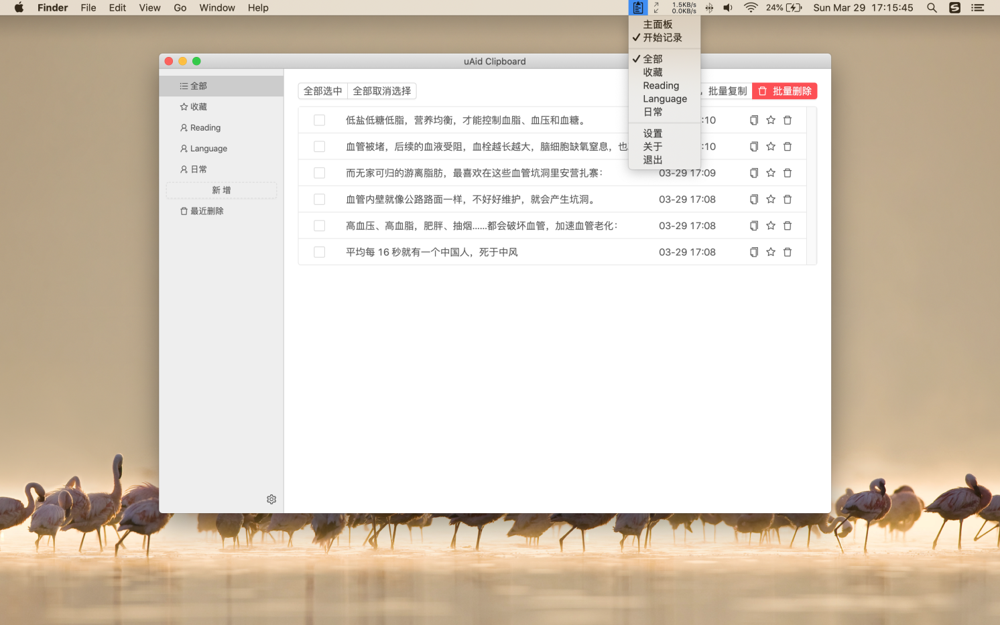
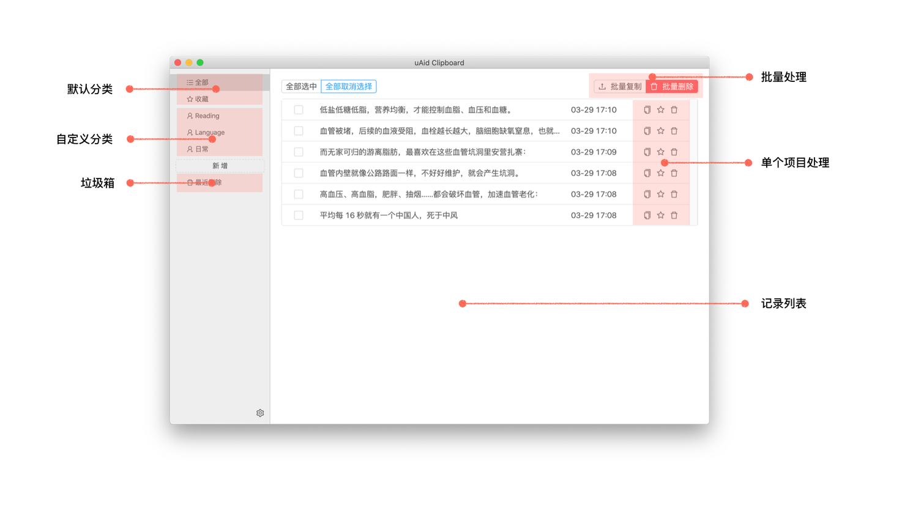
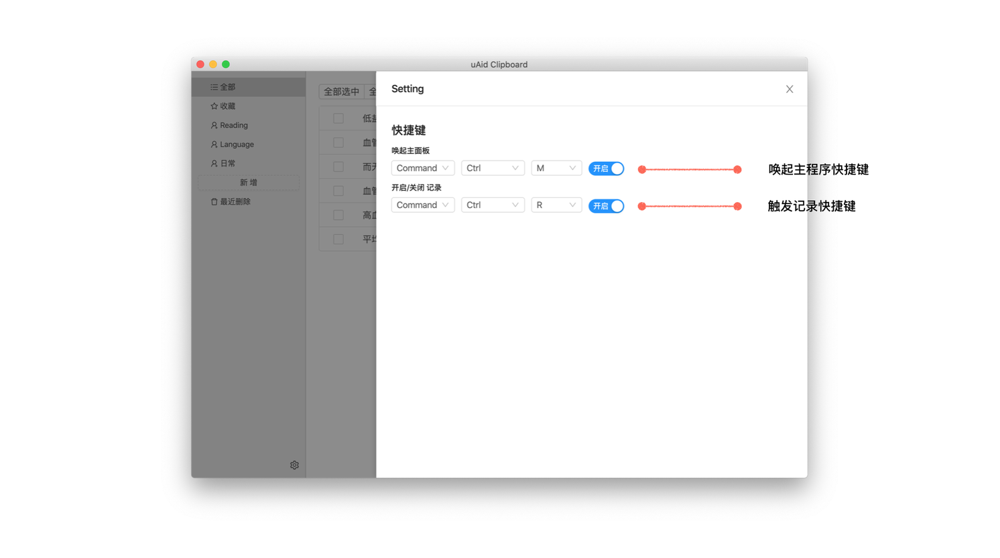
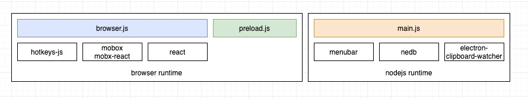
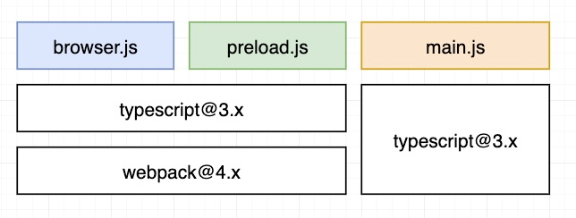

# uAid Clipboard —— 基于Electron的一个小工具的自我总结

## 简介
### 概述
* 场景背景：现在但凡有一点深度讲解的文章动辄上万字，当我们沉浸式阅读时，为了保证阅读质量会避免不必要的应用切换，但是又要做文章的摘要，uAid Clipboard 提供了这个功能，而你要做的只是选中句子右键复制，Clipboard 会帮你记录好，等你完成连续性阅读后再回过头来复习下看看你做了什么。
* 技术背景：尝试下Electron应用开发

### 使用介绍
#### 主面板





### 关于隐私
uAid Clipboard 记录的内容都保存在你的本地，绝对不会上传到服务，你可以从源码上分析出来。

### 安装
有2种形式来获取安装包：

* 直接下载dmg文件安装，安装包地址：(暂不提供)。注意：受到苹果开发者权限限制，安装后无法打开应用，可以通过右键应用打开的方式打开，访达(Finder) -> 应用程序(Applications) -> uaid Clipboard -> 右键 -> 打开（open）
* 下载原码包本地构建安装
  1. git clone git@github.com:cowboykx/uaid-clipboard.git
  2. cnpm install
  3. npm run pack
  4. cd dist
  5. open dmg file


## 架构
### 运行环境依赖


- 整体面向用户侧使用React，状态管理使用 mobx，快捷键使用hotkeys-js
- nodejs执行环境使用了，menubar来做菜单样式，nedb来处理本地存储，electron-clipboard-watcher 来监听系统粘贴板信息

### 编译环境


这里 main.js 指的是在electron nodejs执行环境的js文件，考虑webpack编译nodejs文件没带来太多的价值，只是使用tsc做了一个typescript的编译功能。在webkit执行的 js browser.js 和 preload.js 使用了webpack打包

## 遇到的问题
### webpack 构建器

webpack打包nodejs文件：起初想用webpack打包nodejs文件，需要在webpack配置文件里配置nodejs各种环境，例如 __dirname，但是总体来说带来的收益不大，后来直接使用 ts 做编译。

配置 __dirname，参考文档：[https://zhuanlan.zhihu.com/p/20782320](https://zhuanlan.zhihu.com/p/20782320)
```shell
...
context: __dirname,
node: {
    __filename: false,
    __dirname: false
},
...
```


### babel@8.x.x 的配置

起初没有引入ts，使用babel来编译js，配置webpack和babel真的是一个头疼的事情，花了不少时间，一定要注意babel 和 babel-loader版本，这里记录先之前配置的信息

package.json
```json
{
  "@babel/cli": "^7.0.0-beta.40",
  "@babel/core": "^7.0.0-beta.40",
  "@babel/plugin-proposal-class-properties": "^7.8.3",
  "@babel/plugin-proposal-decorators": "^7.8.3",
  "@babel/preset-env": "^7.8.4",
  "@babel/preset-es2015": "^7.0.0-beta.53",
  "@babel/preset-react": "^7.0.0-beta.40",
  "@babel/preset-stage-0": "^7.0.0",
  "babel-loader": "^8.0.0-beta.0",
  "css-loader": "^3.4.2",
  "extract-text-webpack-plugin": "^4.0.0-beta.0",
  "less": "^3.11.1",
  "less-loader": "^5.0.0",
  "style-loader": "^1.1.3",
  "webpack": "^4.41.6",
  "webpack-cli": "^3.3.11"
}
```

webpack.config.js
```javascript
const Ex = require('extract-text-webpack-plugin');
const path = require('path');
const fs = require('fs');

const projectRoot = path.join(__dirname, '..');

module.exports = {
  mode: 'production',
  entry: {
    'browser': './src/browser/index.jsx'
  },
  output: {
    path: projectRoot,
    filename: './out/[name].js'
  },
  target: 'node',
  optimization: {
    minimize: false
  },
  resolve: {
    extensions: [".jsx", ".js"]
  },
  module: {
    rules: [
      {
        test: /\.(js|jsx)$/,
        loader: "babel-loader"
      },
      {
        test: /\.less|\.css$/,
        loader: Ex.extract({
          fallback: 'style-loader',
          use: ['css-loader', 'less-loader']
        })
      }
    ]
  },
  plugins: [
    new Ex('./out/[name].css'),
  ],
  externals: {
    "antd": "antd",
    "react": "React",
    "react-dom": "ReactDOM",
    "moment": "moment"
  }
}

```

### typescript

#### tsconfig.json
tsconfig没什么好说，在webpack里可以指定tsconfig，针对 browser/preload/main 分别使用三个json，

```javascript
{
  test: /\.(ts|tsx)?$/,
  loader: 'ts-loader',
  exclude: /node_modules/,
  options: {
    configFile: path.resolve(__dirname, '../tsconfig.browser.json')
  }
}
```

#### tsconfig编译参数

这里只提常用的

- target：指定需要编译js的版本
- module: 指定编译后的模块方案
- lib: 指定要包含在编译中的库文件，例如："es5", "es6", "es7", "dom"
- jsx: 指定支持的jsx类型，react-native react preserve
- declaration： 是否生成 *.d.ts 文件
- outDir：输出文件目录，如果是用webpack编译的话，这个选项可以不用
- typeRoots 和 types：这2个参数用来指定 [@type](#) 文件的目录和引入哪些 types，平常我们不会用到。
  - typeRoots 默认为 ./node_modules/@types
  - types：如果设定了，就只会从 typeRoots 取对应的
- experimentalDecorators： 开启装饰器，请设置打开吧


如下为我常用的配置
tsconfig.base.json
```json
{
  "compilerOptions": {
    "baseUrl": ".",
    "esModuleInterop": true,
    "experimentalDecorators": true,
    "allowJs": false,
    "alwaysStrict": true,
    "importHelpers": true,
    "lib": ["es5", "es6", "es7", "dom"],
    "module": "CommonJS",
    "moduleResolution": "node",
    "noEmitOnError": true,
    "noImplicitThis": true,
    "noImplicitAny": false,
    "sourceMap": false,
    "declaration": false,
    "declarationMap": false,
    "target": "es2017",
    "resolveJsonModule": true,
    "paths": {
    }
  }
}
```

tsconfig.node.json

```json
{
  "extends": "./tsconfig.base",
  "compilerOptions": {
    "target": "ES5",
    "outDir": "out/node"
  },
  "include": [
    "./src/node"
  ]
}
```

### Mobx

#### mobx store

请开启 enforceActions，修改数值必须通过 action

```javascript
import { configure } from 'mobx';

configure({
  enforceActions: true
});
```

#### mobx 异步修改状态

大部分时间我们使用 async/await 来做协程，async 函数里我们只能通过 runInAction 来改变状态

```javascript
import { runInAction, action } from 'mobx';

class Store {
 ...
 @action
	update() {
  	...
    runInAction(() => {
    	...
    })
    ...
  }
 
 ...
  
}
```

### npm
#### 关闭 package-lock.json 文件生成

vim ~/.npmrc
```html
package-lock=false
```


#### 设置淘宝源
vim ~/.npmrc
```html
registry=https://registry.npm.taobao.org/
```
### Electron

#### 设置 electron 源文件地址
受到网络影响，国外站点的资源无法获取，可以设置下electron的国内镜像地址<br />vim ~/.npmrc<br />

```html
ELECTRON_MIRROR=http://npm.taobao.org/mirrors/electron/
```

#### CSP 同源策略
在html里异步加载资源会报错，例如antd在做状态时会动态插入一些样式，这个时候你需要指定下同源策略

```html
<head>
	<meta http-equiv="Content-Security-Policy" content="default-src 'self' 'unsafe-inline'; script-src 'self'">
	<meta http-equiv="X-Content-Security-Policy" content="default-src 'unsafe-inline'; script-src 'self'">
</head>
```

#### 打包
使用 electron-builder 打包（[https://www.electron.build/](https://www.electron.build/)），包的icon放到 根目录的build目录下，[https://www.electron.build/icons](https://www.electron.build/icons)

打包脚本，package.json

```html
scripts: {
	"pack": "npm run build && electron-builder --mac --x64"
}
```

#### 打包镜像下载

electron-builder 在打包时会检测cache中是否有electron 包，如果没有的话会从github上拉去，在国内网络环境中拉取的过程大概率会失败，所以你可以自己去下载一个包放到cache目录里，参考：[https://github.com/electron/get#how-it-works](https://github.com/electron/get#how-it-works)

各个平台的目录地址

- Linux: $XDG_CACHE_HOME or ~/.cache/electron/
- MacOS: ~/Library/Caches/electron/
- Windows: %LOCALAPPDATA%/electron/Cache or ~/AppData/Local/electron/Cache/


例如在macos平台打包electron应用，执行 electron-builder --mac --x64

```
➜  clipboard git:(master) ✗ npm run dist
> clipboard@1.0.0 dist /Users/xx/workspace/electron/clipboard
> electron-builder --mac --x64
  • electron-builder  version=22.3.2 os=18.7.0
  • loaded configuration  file=package.json ("build" field)
  • writing effective config  file=dist/builder-effective-config.yaml
  • packaging       platform=darwin arch=x64 electron=8.0.0 appOutDir=dist/mac
  • downloading     url=https://github.com/electron/electron/releases/download/v8.0.0/electron-v8.0.0-darwin-x64.zip size=66 MB parts=8
```

可以单独下载这个包 [https://github.com/electron/electron/releases/download/v8.0.0/electron-v8.0.0-darwin-x64.zip，](https://github.com/electron/electron/releases/download/v8.0.0/electron-v8.0.0-darwin-x64.zip%EF%BC%8C) 放到~/Library/Caches/electron/ 目录下

谢谢
